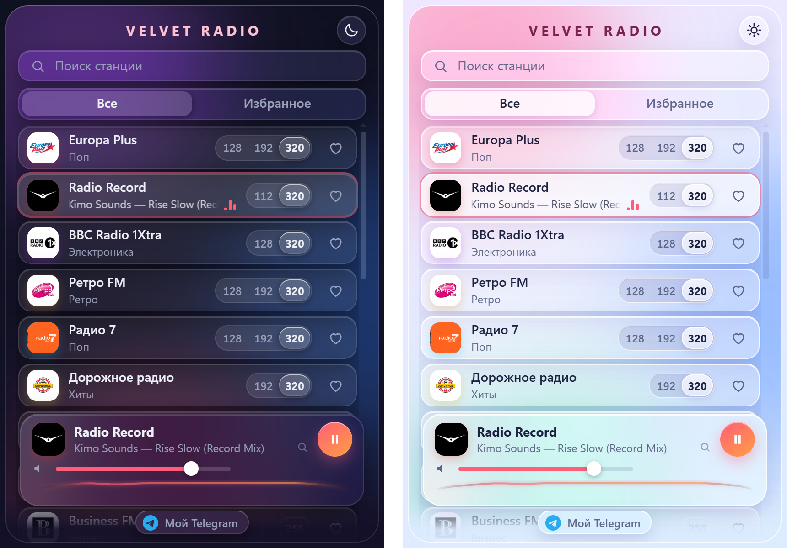

# Velvet Radio

**Красивое радио для Chrome. 21 станция, качество до 320 kbps, названия песен, мягкий «жидкий стеклянный» интерфейс.**

*A refined Chrome extension for Russian internet radio — high-bitrate streams, mirrors with automatic failover, live track titles, and a soft liquid-glass UI.*

## Возможности

- **Реальное качество.** Для каждой станции собраны потоки 128–320 kbps; переключатель качества прямо в строке станции. Все цифры замерены на живом потоке, а не взяты из названия.
- **Не молчит.** Если поток упал, расширение само пробует резервные адреса, затем снижает качество и только потом сообщает «станция недоступна».
- **Играет в фоне.** Закрыли окно, а музыка идёт. На иконке горит «ON», в подсказке видно станцию и песню.
- **Что играет сейчас.** Название песни из тех же источников, что использует официальный сайт станции. Клик по названию ищет песню в Google.
- **Мягкий визуализатор.** Тонкая плавная линия, которая следит за звуком (там, где станция это разрешает).
- **Свой порядок.** Плашки станций перетаскиваются мышью.
- **Горячие клавиши и медиа-кнопки.** Пауза, следующая и предыдущая станция с клавиатуры и наушников.
- **Светлая и тёмная тема** с плавным переключением, компактное скруглённое окно.
- **Приватность.** Никакой аналитики, слежки и стороннего кода: всё работает внутри расширения.

## Станции

| Станция | Качество, kbps | Жанр | Песня |
|---|---|---|:-:|
| Europa Plus | 128 · 192 · 320 | Поп | ✓ |
| Radio Record | 112 · 320 | Танцы | ✓ |
| BBC Radio 1Xtra | 128 · 320 | Электроника | ✓ |
| Ретро FM | 128 · 192 · 320 | Ретро | ✓ |
| Радио 7 | 128 · 192 · 320 | Поп | ✓ |
| Дорожное радио | 192 · 320 | Хиты | ✓ |
| Вести FM | 128 · 192 · 320 | Новости | — |
| Радио Маяк | 128 · 192 · 320 | Новости | — |
| Business FM | 256 | Бизнес | — |
| Радио Шансон | 128 · 256 | Шансон | — |
| Radio Ultra | 128 · 192 · 256 | Рок | ✓ |
| Наше Радио | 128 · 256 | Рок | ✓ |
| Русское Радио | 128 · 256 | Русские хиты | ✓ |
| Радио DFM | 128 | Танцы | ✓ |
| Радио Maximum | 128 · 256 | Рок и поп | ✓ |
| Хит FM | 128 | Хиты | ✓ |
| Radio Monte Carlo | 128 | Лаунж | ✓ |
| Love Radio | 128 | Романтика | ✓ |
| Relax FM · Chill Out | 128 | Чилаут | ✓ |
| Радио Звезда | 128 | Разное | — |
| Comedy Radio | 128 | Юмор | ✓ |

«Песня» — доступно название текущей песни. У разговорных станций и у станций без открытого источника его нет.
Часть станций вещает из России и может быть недоступна за рубежом.

## Установка

Расширение пока не опубликовано в Chrome Web Store, поэтому ставится вручную (30 секунд):

1. Скачайте архив `velvet-radio-*.zip` со страницы [Releases](../../releases) и распакуйте его в любую папку.
2. Откройте в Chrome `chrome://extensions` и включите **«Режим разработчика»** (справа вверху).
3. Нажмите **«Загрузить распакованное»** и выберите распакованную папку.
4. Нажмите значок пазла в панели Chrome и закрепите **Velvet Radio**.

Обновление: распакуйте новый архив поверх и нажмите ⟳ на карточке расширения.

## Горячие клавиши

| Действие | Сочетание по умолчанию |
|---|---|
| Пауза / продолжить | `Alt` + `Shift` + `P` |
| Следующая станция | `Alt` + `Shift` + `→` |
| Предыдущая станция | `Alt` + `Shift` + `←` |

Изменить можно на `chrome://extensions/shortcuts`. Мультимедиа-кнопки клавиатуры и наушников тоже работают.

## Как это устроено

Расширение на **Manifest V3**, чистый JavaScript без сборки.

| Файл | Назначение |
|---|---|
| `stations.js` | Каталог станций: качества, потоки, зеркала |
| `offscreen.js` | Движок звука: запас буфера, зеркала, автопереподключение, визуализатор, MediaSession |
| `background.js` | Состояние, иконка и значок, горячие клавиши |
| `nowplaying.js` | Источники названий песен |
| `popup.html/css/js` | Окно расширения |
| `vendor/hls.min.js` | [hls.js](https://github.com/video-dev/hls.js) для потоков HLS (лежит внутри, не подгружается из сети) |

Звук играет в скрытом документе (`offscreen`), поэтому не прерывается при закрытии окна. Перед стартом набирается запас звука, чтобы не было заиканий.

## Добавление станций и планы

- Правила добавления и проверки станций: [`ADDING-STATIONS.md`](ADDING-STATIONS.md)
- План обновлений: [`ROADMAP.md`](ROADMAP.md)

Нашли станцию, которая не играет? Откройте [issue](../../issues/new/choose): потоки иногда меняются, и их нужно обновлять.

## Важно знать

- **Неофициальный проект.** Названия и логотипы станций принадлежат их владельцам и используются только для узнавания. Расширение лишь проигрывает общедоступные потоки.
- **Потоки могут меняться.** Станция вправе закрыть или переименовать поток. Для этого есть резервные адреса и автоматическое снижение качества.
- **Реальный битрейт.** Название потока часто врёт (например, «320k» на деле 128), поэтому в каталоге указан замеренный.

## Автор

Сделано одним человеком с помощью ИИ. Вопросы и предложения: [Telegram @sushtrsx](https://t.me/sushtrsx).

## Лицензия

[MIT](LICENSE)
